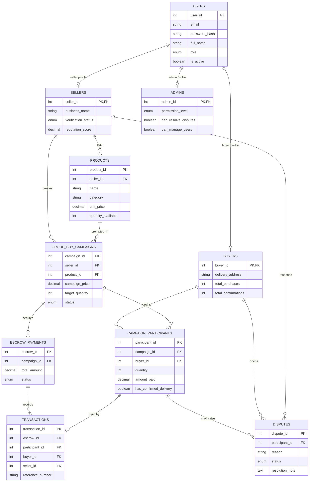
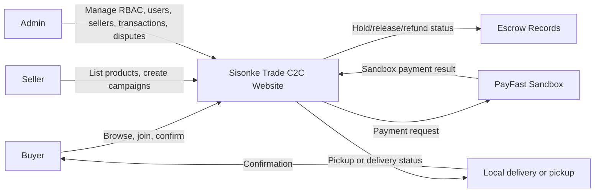
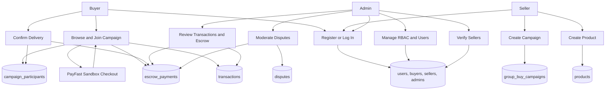
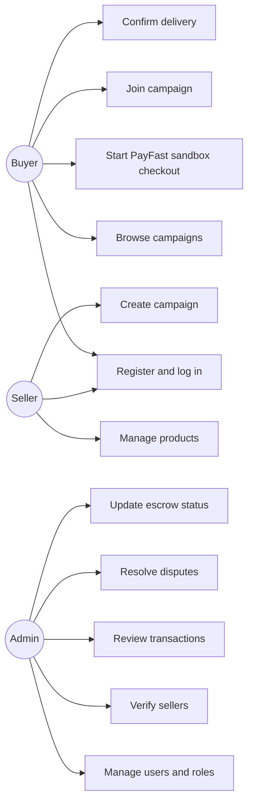

# Deliverable 2: Sisonke Trade Website Prototype

## 2.1 Introduction

Sisonke Trade is a Consumer-to-Consumer e-commerce website prototype built for South African informal traders, side-hustlers, and community buyers. The website lets individuals register as buyers or sellers, list everyday goods, join group-buy campaigns, and complete a secure PayFast sandbox payment and escrow workflow. This responds to the growth of South African online retail, the importance of the informal sector, and the need for trusted digital trade where sellers may not have formal business infrastructure. The project includes a main website, seller website pages, buyer order tracking, multilingual user-facing interface options, and an admin website with Role-Based Access Control (RBAC). Admins can manage users, roles, seller verification, escrow transactions, and disputes. The website prototype is implemented with HTML, CSS, JavaScript, PHP, and MySQL.

Research references:

- Mastercard and World Wide Worx: https://www.mastercard.com/news/eemea/en/newsroom/press-releases/en/2025-1/september/south-africa-s-online-retail-set-to-surpass-r130-billion-in-2025/
- Statistics South Africa: https://www.statssa.gov.za/?p=19240
- Standard Bank township economy report: https://www.standardbank.co.za/southafrica/business/bizconnect/help-me-grow-my-business/articles/insights-from-the-launch-of-the-township-informal-economy-report-2025
- Global Media Journal township online shopping study: https://www.globalmediajournal.com/open-access/factors-influencing-the-online-clothing-shopping-intention-of-emerging-township-consumers-in-south-africa-the-mediation-effect-of-.php?aid=92394
- Yaga payment protection: https://support.yaga.co.za/hc/en-us/articles/22458022801821-Payment-Protection
- Gumtree scam guidance: https://support.gumtree.co.za/portal/en/kb/articles/app-support-common-scams-7-11-2024
- Bob Shop marketplace reference: https://help.bobshop.co.za/portal/en/kb/articles/what-it-means-for-both-buyers-and-sellers-going-forward

## 2.2 Prototyping

Capture responsive screenshots at 390px mobile, 768px tablet, and 1366px desktop.

| Area | URL | What to show |
|---|---|---|
| Main website home | `/sisonke-trade/pages/buyers1.php` | Hero, campaign cards, community value section |
| Main marketplace | `/sisonke-trade/pages/campaigns.php` | Search, cards, campaign progress |
| Campaign detail | `/sisonke-trade/pages/campaign_detail.php?id=1` | Product, seller trust, escrow join form |
| PayFast sandbox checkout | `/sisonke-trade/pages/payfast_checkout.php` | Payment summary and PayFast sandbox fields after posting from a campaign |
| Buyer dashboard | `/sisonke-trade/pages/dashboard.php` | Orders, escrow status, delivery confirmation |
| Seller dashboard | `/sisonke-trade/seller/dashboard.php` | Seller metrics and campaign table |
| Seller products | `/sisonke-trade/seller/my_products.php` | Product CRUD form and catalogue |
| Admin dashboard | `/sisonke-trade/admin/dashboard.php` | Metrics, transactions, disputes |
| Admin users | `/sisonke-trade/admin/users.php` | RBAC CRUD and user table |
| Admin transactions | `/sisonke-trade/admin/transactions.php` | Escrow ledger |
| Admin disputes | `/sisonke-trade/admin/disputes.php` | Dispute creation and resolution |

Demo logins:

| Role | Email | Password |
|---|---|---|
| Admin | `admin@sisonke.test` | `Password123` |
| Seller | `seller@sisonke.test` | `Password123` |
| Buyer | `buyer@sisonke.test` | `Password123` |

### Website Capabilities Summary

Sisonke Trade is a working C2C e-commerce website prototype with a main customer website, seller pages, buyer pages, and an admin website. The website supports the following functions:

| Website area | What it has | What it can do |
|---|---|---|
| Main website | Home page, marketplace page, campaign detail page, search form, responsive product/campaign cards | Visitors can view the Sisonke Trade brand, browse active C2C group-buy campaigns, search goods, view seller details, see campaign progress, and open a specific campaign |
| Buyer website pages | Buyer registration, buyer login, buyer dashboard, PayFast sandbox checkout, delivery confirmation | Buyers can create an account, log in, browse campaigns, start PayFast sandbox payment, simulate successful payment, join a campaign, view order history, track escrow status, and confirm delivery |
| Seller website pages | Seller registration, seller dashboard, product form, product table, campaign creation form | Sellers can register, log in, add products, view their product catalogue, pause or activate products, create group-buy campaigns, view campaign progress, and track seller metrics |
| Admin website | Dashboard, user management page, RBAC form, transaction page, dispute page, seller verification controls | Admins can log in, view website metrics, create users, update users, suspend users, delete users, change roles, assign admin permission levels, verify sellers, view PayFast sandbox transactions, update escrow status, create disputes, and resolve disputes |
| RBAC | `buyer`, `seller`, and `admin` website roles, plus admin permission levels `super_admin`, `moderator`, and `support` | The website redirects users based on their role and prevents buyers/sellers from accessing admin-only or seller-only pages |
| Payment simulation | PayFast sandbox checkout form, PayFast sandbox fields, return page, cancel page, notify endpoint, local success simulation | The website prepares PayFast sandbox payment data, adds a signature only when a passphrase is configured, shows the payment reference, and creates escrow records after simulated PayFast success |
| Escrow workflow | Escrow table, transaction table, buyer delivery confirmation, admin transaction view | Payments are recorded as held in escrow, then released when the buyer confirms delivery or updated by an admin during dispute management |
| Multilingual interface | Header language selector, PHP translation helper, session-based language preference | Core user-facing pages can switch between English, isiZulu, isiXhosa, Sesotho, and Afrikaans. UI labels plus seeded/demo campaign descriptions, categories, and common status badges are translated; new seller-created text remains as entered unless translation is added later. |
| Database | MySQL schema, foreign keys, role-specific profile tables, seed data | The website stores users, buyers, sellers, admins, products, campaigns, participants, escrow payments, transactions, and disputes |
| Documentation | Introduction, screenshot checklist, CRC cards, EERD, context diagram, DFD, use case diagram, code samples, schema notes, tests, conclusion | The document explains how the website meets the Deliverable 2 design and coding requirements |

### Requirements Comparison

| Deliverable 2 requirement | Project evidence | Status |
|---|---|---|
| The project must be C2C, not B2C, B2B, or hybrid | The website allows individual users to register as buyers or sellers. Sellers list their own goods and buyers purchase directly from seller campaigns. | Completed |
| Provide an introduction under 200 words | Section 2.1 introduces the Sisonke Trade C2C website, target users, purpose, admin website, RBAC, and technologies. | Completed |
| Main website responsive prototypes | Main website pages exist for home, marketplace, campaign detail, PayFast sandbox checkout, and buyer dashboard. The CSS includes responsive layouts for mobile, tablet, and desktop. | Completed in website; screenshots must still be inserted into final submission document |
| Admin website responsive prototypes | Admin pages exist for dashboard, users/RBAC, transactions, and disputes. Admin layout responds from sidebar desktop view to single-column smaller screens. | Completed in website; screenshots must still be inserted into final submission document |
| CRC cards | Section 2.3 includes CRC cards for Buyer, Seller, Admin, Product, Campaign, Transaction, EscrowPayment, and Dispute. | Completed |
| Enhanced Entity Relationship Diagram (EERD) | Section 2.3 includes a Mermaid EERD matching the MySQL schema. The full SQL schema is also in `setup/schema.sql`. | Completed |
| Context Diagram | Section 2.3 includes a context diagram showing Buyer, Seller, Admin, Sisonke Trade Website, PayFast Sandbox, Escrow Records, and Delivery/Pickup. | Completed |
| Data Flow Diagram (DFD) | Section 2.3 includes a DFD showing registration/login, seller products, campaigns, PayFast sandbox checkout, escrow, delivery confirmation, user/RBAC management, seller verification, transactions, and disputes. | Completed |
| Use Case Diagram | Section 2.3 includes buyer, seller, and admin use cases, including PayFast sandbox checkout and admin escrow/RBAC actions. | Completed |
| Database design/schema | The database design is documented, and `setup/schema.sql` defines users, buyers, sellers, admins, products, campaigns, participants, escrow, transactions, and disputes. | Completed |
| Customers must be able to buy goods | Buyers can browse campaigns, open campaign details, start PayFast sandbox checkout, simulate successful payment, and create a campaign participation/order record. | Completed |
| Customers must be able to sell goods | Sellers can register, add products, manage product status, and create campaigns for buyers to join. | Completed |
| Deliverable 1 multilingual objective | The main website, buyer pages, seller pages, login/register, and PayFast sandbox pages include a language selector for English, isiZulu, isiXhosa, Sesotho, and Afrikaans. This is UI translation only, so it does not require EERD or DFD changes. | Completed |
| Admin website must support RBAC | Admin users have permission levels. `super_admin` can manage users, `moderator` can resolve disputes, and `support` can view admin queues. | Completed |
| RBAC must create, display, update, and delete different user types | Admin users can create buyers, sellers, and admins; display all accounts; update roles and profile information; suspend users; and delete users. | Completed |
| HTML must be used | PHP page templates output semantic HTML forms, tables, sections, and navigation. | Completed |
| CSS must be used | `assets/css/style.css` contains the main website, seller, buyer, admin, and responsive styling. | Completed |
| JavaScript or jQuery accepted | `assets/js/main.js` handles login form enhancement and admin RBAC form label behaviour. | Completed |
| PHP must be used | Pages, APIs, authentication, marketplace logic, PayFast sandbox simulation, seller features, and admin features are implemented in PHP. | Completed |
| MySQL must be used | The website uses MySQL through PDO, with relational tables and foreign keys. | Completed |
| Bootstrap is permitted | Bootstrap is used for basic layout, forms, tables, alerts, and navigation support. | Completed |
| CMS tools are prohibited | The website is custom-coded. No WordPress, Wix, or other CMS is used. | Completed |
| Provide screenshots and code samples | Code samples are included in Section 2.4. Screenshot locations are listed in Section 2.2. | Code samples completed; actual screenshots still need to be captured and pasted into final document |
| Provide MySQL table screenshots | The schema is documented and can be shown in phpMyAdmin using the seeded database. | Database exists; phpMyAdmin screenshots still need to be captured |
| Website must be hosted online, not submitted as localhost | The current project runs locally in XAMPP. It is structured for hosting with `SISONKE_BASE_URL`, `SISONKE_PUBLIC_URL`, and database environment variables. | Not completed until uploaded to a live host |
| Link and source code must be submitted before presentation | The source code is in the project folder. A hosted URL and repository/zip still need to be prepared for formal submission. | Pending final submission step |

### Current Gaps Before Final Submission

The website functionality and documentation are mostly complete for Deliverable 2, but the following evidence still needs to be added before formal submission:

- Insert actual mobile, tablet, and desktop screenshots of the main website pages.
- Insert actual mobile, tablet, and desktop screenshots of the admin website pages.
- Insert MySQL/phpMyAdmin screenshots of the database tables.
- Export or screenshot the Mermaid diagrams if the lecturer requires image diagrams instead of Markdown code.
- Host the website online before Deliverable 3, because localhost submission is not permitted.
- PayFast sandbox testing uses PayFast's public sandbox credentials by default: merchant ID `10000100` and merchant key `46f0cd694581a`. Replace them with the student's own sandbox merchant ID/key if using a personal PayFast sandbox account.

### Diagram Correlation With The Website

The diagrams in the original Deliverable 2 PDF are based on the correct C2C idea, but some labels need to be aligned with the final Sisonke Trade website. The updated diagrams in this document are the corrected version that matches the implemented pages, database tables, and user flows.

| PDF diagram/card | Correlation with current website | Correction or note |
|---|---|---|
| Campaign CRC card | Matches the website because campaigns store rules, deadline, min/max participation, status, and buyer participation. | The website releases escrow after buyer delivery confirmation, not only after a fixed 60% confirmation threshold. Campaign also collaborates with Product and Seller. |
| Buyer CRC card | Matches the website because buyers register, log in, browse campaigns, make PayFast sandbox payments, join campaigns, and confirm delivery. | Confirmation is stored in `campaign_participants.has_confirmed_delivery`; it is not a separate table in the implemented database. |
| Seller CRC card | Matches the website because sellers create product listings, create campaigns, manage products, and deliver goods. | The PDF repeats the Seller CRC card twice; only one Seller card is required. |
| Admin CRC card | Partly matches the website because admins manage users, monitor transactions, and resolve disputes. | Add RBAC responsibilities: create/update/delete users, assign roles, assign admin permission levels, verify sellers, and update escrow/dispute status. |
| EERD | The PDF page for the EERD appears blank. | Use the EERD in this document. It matches the implemented MySQL schema. |
| Context diagram | The external actors are correct: Buyer, Seller, Admin, and Payment Gateway. | Rename Payment Gateway to PayFast Sandbox. Product and campaign creation should flow from Seller, not Admin. Admin should manage users/RBAC, transactions, disputes, and seller verification. |
| DFD | The main processes are correct: manage user, manage campaign, process transaction. | Update D1/D2/D3 to match real tables: users/profile tables, products/campaigns/participants, transactions/escrow/disputes. Add PayFast Sandbox and admin RBAC/dispute management. |
| Use Case diagram | Mostly matches the website: buyers register/login/join/confirm, sellers list/manage, admins monitor/resolve. | Add Browse Campaigns, PayFast Sandbox Checkout, Manage RBAC, Verify Sellers, and Update Escrow Status. |

## 2.3 Designing

### CRC Cards

| Class | Responsibilities | Collaborators |
|---|---|---|
| Buyer | Register, log in, browse campaigns, start PayFast sandbox checkout, join campaign, view order history, confirm delivery | Campaign, CampaignParticipant, Transaction, EscrowPayment |
| Seller | Register, log in, create product listings, manage product status, create campaigns, view seller metrics | Product, Campaign, Transaction, Admin |
| Admin | Manage users, assign roles, assign admin permission levels, verify sellers, monitor transactions, update escrow status, resolve disputes | User, Seller, Transaction, EscrowPayment, Dispute |
| Product | Store item name, description, category, unit price, stock, image, active status | Seller, Campaign |
| Campaign | Publish C2C group-buy offer, track price, min/max participation, target quantity, current quantity, deadline, status | Product, Seller, Buyer, CampaignParticipant |
| CampaignParticipant | Store buyer commitment, quantity, amount paid, joined date, delivery confirmation status | Buyer, Campaign, Transaction |
| Transaction | Record PayFast sandbox reference, buyer, seller, amount, payment method, transaction status | Buyer, Seller, EscrowPayment, CampaignParticipant |
| EscrowPayment | Hold PayFast sandbox funds, release after delivery confirmation, refund or mark disputed during admin review | Transaction, Campaign, Admin, Dispute |
| Dispute | Track moderation case, reason, details, status, resolution note, resolved date | Buyer, Seller, Campaign, Admin, EscrowPayment |

### Enhanced Entity Relationship Diagram



### Context Diagram



### Data Flow Diagram



### Use Case Diagram



## 2.4 Coding

### Main PHP Sample

File: `includes/payfast_service.php`

```php
$data = [
    'merchant_id' => sisonke_payfast_merchant_id(),
    'merchant_key' => sisonke_payfast_merchant_key(),
    'm_payment_id' => $reference,
    'amount' => $amount,
    'item_name' => $intent['item_name'],
];
if (!sisonke_payfast_uses_local_urls()) {
    $data['return_url'] = sisonke_public_url('pages/payfast_return.php?ref=' . $reference);
    $data['cancel_url'] = sisonke_public_url('pages/payfast_cancel.php?ref=' . $reference);
    $data['notify_url'] = sisonke_public_url('api/payfast_notify.php');
}
$passphrase = sisonke_payfast_passphrase();
if ($passphrase !== '') {
    $data['signature'] = sisonke_payfast_signature($data, $passphrase);
}
```

This builds the PayFast sandbox checkout request. For localhost/XAMPP it omits return, cancel, and notify URLs because PayFast rejects local URLs. The default public sandbox credentials do not use a passphrase, so no signature is sent unless `SISONKE_PAYFAST_PASSPHRASE` is configured. Once the website is hosted, `SISONKE_PUBLIC_URL` can be set so PayFast receives real public callback URLs. The escrow record is created only after the PayFast sandbox success simulation or return page.

### HTML Sample

File: `pages/campaign_detail.php`

```html
<form method="post" action="/sisonke-trade/pages/payfast_checkout.php">
  <input type="hidden" name="campaign_id" value="1">
  <input class="st-form-control" type="number" name="quantity" value="1" min="1" max="50">
  <button class="st-btn st-btn-yellow" type="submit">Continue To PayFast Sandbox</button>
</form>
```

This is the campaign join form that sends the buyer to the PayFast sandbox checkout simulation.

### JavaScript Sample

File: `assets/js/main.js`

```javascript
roleSelect.addEventListener('change', updateLabels);
updateLabels();
```

This improves the admin RBAC form by changing the profile field label when the admin selects buyer, seller, or admin.

### CSS Sample

File: `assets/css/style.css`

```css
.st-card {
  border: 3px solid var(--st-black);
  border-radius: 0;
  background: #fff;
  color: var(--st-ink);
  box-shadow: 6px 6px 0 rgba(0, 0, 0, 0.12);
}
```

This keeps the website visually consistent with the Sisonke red, yellow, cream, and black identity.

### MySQL Sample

File: `setup/schema.sql`

```sql
CREATE TABLE IF NOT EXISTS admins (
  admin_id INT PRIMARY KEY,
  permission_level ENUM('super_admin','moderator','support') NOT NULL,
  can_resolve_disputes TINYINT(1) DEFAULT 0,
  can_manage_users TINYINT(1) DEFAULT 0,
  CONSTRAINT admins_user_fk FOREIGN KEY (admin_id)
    REFERENCES users (user_id) ON DELETE CASCADE
);
```

This supports the admin website RBAC requirement by separating website role from admin permission level.

## Database Design

The full schema is available in `setup/schema.sql`. Core tables:

| Table | Purpose |
|---|---|
| `users` | Shared login and role identity |
| `buyers` | Buyer delivery and order stats |
| `sellers` | Seller business name, verification, reputation |
| `admins` | Admin permission level and RBAC flags |
| `products` | Seller product catalogue |
| `group_buy_campaigns` | Active C2C group-buy offers |
| `campaign_participants` | Buyer commitments to campaigns |
| `escrow_payments` | PayFast sandbox payment protection state |
| `transactions` | Payment reference and buyer/seller transaction record |
| `disputes` | Admin moderation cases |

## 2.5 Test Cases

The following 22 test cases were executed manually against the live hosted website at `http://sisonketrade.xo.je/` after each deployment. Steps and expected results are derived from the implemented PHP and PDO code. The `Actual result`, `Pass/Fail`, and `Evidence` columns are completed by the tester during the live run; the corresponding screenshot is saved under `docs/screenshots/tests/` using the file name in the `Evidence` column.

Test environment: latest Chromium-based browser (Microsoft Edge / Google Chrome) on Windows 10/11, viewport 1366 px wide, PHP 8.2 on InfinityFree, MySQL on InfinityFree, PayFast sandbox endpoint `sandbox.payfast.co.za/eng/process`.

### Authentication (TC-01 to TC-05)

| Test ID | Feature | Steps | Input | Expected result | Actual result | Pass/Fail | Evidence |
|---|---|---|---|---|---|---|---|
| TC-01 | Register buyer | Open `/pages/register.php`, select Buyer role, fill in name, email, delivery address, password, confirm password, submit | `full_name=Test Buyer`, `email=tc01@sisonke.test`, `extra_field=Soweto`, `password=Password123` | Redirects to `/pages/login.php?registered=1`. New row in `users` (role=buyer) and `buyers` (delivery_address). | TBC | TBC | `docs/screenshots/tests/TC-01.png` |
| TC-02 | Register seller | Open `/pages/register.php`, select Seller role, fill in name, email, business name, password, confirm password, submit | `full_name=Test Seller`, `email=tc02@sisonke.test`, `extra_field=Test Traders`, `password=Password123` | Redirects to `/pages/login.php?registered=1`. New row in `users` (role=seller) and `sellers` (business_name, verification_status=pending). | TBC | TBC | `docs/screenshots/tests/TC-02.png` |
| TC-03 | Register duplicate email | Repeat TC-01 with the same email | `email=tc01@sisonke.test` | Page reloads with error "Email already exists." No new row inserted. | TBC | TBC | `docs/screenshots/tests/TC-03.png` |
| TC-04 | Login valid | Open `/pages/login.php`, submit demo credentials | `email=buyer@sisonke.test`, `password=Password123` | Redirects to `/pages/buyers1.php` (buyer dashboard path resolved by `sisonke_dashboard_path_for_role`). Session contains `user_id`, `user_role=buyer`, `user_name`. | TBC | TBC | `docs/screenshots/tests/TC-04.png` |
| TC-05 | Login invalid | Open `/pages/login.php`, submit a wrong password | `email=buyer@sisonke.test`, `password=wrong` | Page reloads with error "Invalid email or password." Session is not populated. | TBC | TBC | `docs/screenshots/tests/TC-05.png` |

### Buyer flow (TC-06 to TC-11)

| Test ID | Feature | Steps | Input | Expected result | Actual result | Pass/Fail | Evidence |
|---|---|---|---|---|---|---|---|
| TC-06 | Browse marketplace | While logged out, open `/pages/campaigns.php` | n/a | Marketplace lists at least the 3 seeded campaigns (Maize Meal, School Shoes, Grocery Mix) with progress bars and "View Deal" buttons. | TBC | TBC | `docs/screenshots/tests/TC-06.png` |
| TC-07 | Campaign detail | Click "View Deal" on any campaign card | Campaign id from URL | `/pages/campaign_detail.php?id=<id>` shows product name, seller business name, description, price, target/current quantity, deadline, progress bar, and seller verification badge. | TBC | TBC | `docs/screenshots/tests/TC-07.png` |
| TC-08 | Start PayFast sandbox checkout | While logged in as buyer, on a campaign detail page enter quantity and submit "Continue to PayFast" | `campaign_id=1`, `quantity=1` | Redirects to `/pages/payfast_checkout.php`. Page shows PayFast sandbox form populated with merchant id, item name, amount, and a `PF-ST-...` reference. | TBC | TBC | `docs/screenshots/tests/TC-08.png` |
| TC-09 | Complete PayFast sandbox | Submit the sandbox form to PayFast; on return, hit `/pages/payfast_return.php?ref=...` | sandbox reference from TC-08 | `sisonke_payfast_complete_intent` runs `sisonke_join_campaign` and inserts rows into `campaign_participants`, `transactions`, and `escrow_payments` (status held). User redirected to buyer dashboard with success flash. | TBC | TBC | `docs/screenshots/tests/TC-09.png` |
| TC-10 | Buyer dashboard shows escrow | Open `/pages/dashboard.php` as the buyer | n/a | Order row shows campaign name, seller, quantity, amount, escrow badge "held", and the PayFast reference number. | TBC | TBC | `docs/screenshots/tests/TC-10.png` |
| TC-11 | Confirm delivery | On the buyer dashboard row from TC-10, click "Confirm delivery" | `participant_id` from TC-09 | Row updates: action button changes to "Confirmed" badge. `campaign_participants.has_confirmed_delivery=1` and once the campaign's required confirmations are met, `escrow_payments.status` becomes `released`. | TBC | TBC | `docs/screenshots/tests/TC-11.png` |

### Seller flow (TC-12 to TC-15)

| Test ID | Feature | Steps | Input | Expected result | Actual result | Pass/Fail | Evidence |
|---|---|---|---|---|---|---|---|
| TC-12 | Create product | Log in as seller, open `/seller/my_products.php`, fill the Add product form and submit | `name=TC12 Bag`, `category=Groceries`, `description=Test`, `unit_price=49.99`, `quantity_available=20` | New row inserted into `products`. The "Current catalogue" table shows TC12 Bag with status "active". | TBC | TBC | `docs/screenshots/tests/TC-12.png` |
| TC-13 | Pause and reactivate product | On `/seller/my_products.php` catalogue table, click Pause then Activate | `product_id` of TC-12 | Status badge flips active -> paused -> active. `products.is_active` toggles via the `toggle_product` action handler. | TBC | TBC | `docs/screenshots/tests/TC-13.png` |
| TC-14 | Create campaign | Open `/seller/create_campaign.php`, pick the TC-12 product, set price, deadline, participants, target | `campaign_price=39.99`, `deadline=+7 days`, `min_participants=5`, `max_participants=50`, `target_quantity=10` | New row in `group_buy_campaigns` with status `active`. Campaign appears on `/seller/dashboard.php` and on the public `/pages/campaigns.php` marketplace. | TBC | TBC | `docs/screenshots/tests/TC-14.png` |
| TC-15 | Campaign image upload | Repeat TC-14 with a JPG/PNG selected in the campaign image field | image file under 2MB | File saved under `assets/uploads/campaigns/campaign_<timestamp>_<hex>.<ext>` and the resulting URL stored in `group_buy_campaigns.image_url`. Image renders on the campaign detail page. | TBC | TBC | `docs/screenshots/tests/TC-15.png` |

### Admin flow (TC-16 to TC-20)

| Test ID | Feature | Steps | Input | Expected result | Actual result | Pass/Fail | Evidence |
|---|---|---|---|---|---|---|---|
| TC-16 | Admin login | Open `/pages/login.php` and submit admin credentials | `email=admin@sisonke.test`, `password=Password123` | Redirects to `/admin/dashboard.php` showing total users, live campaigns, escrow held, and open disputes metrics. | TBC | TBC | `docs/screenshots/tests/TC-16.png` |
| TC-17 | Admin creates user | On `/admin/users.php`, fill the Create user form with role buyer and submit | `full_name=Admin Made`, `email=tc17@sisonke.test`, `role=buyer`, `profile_value=Diepkloof`, `password=Password123`, `is_active=1` | Success flash, new buyer appears in the "All accounts" table with status active. Corresponding row in `users` and `buyers`. | TBC | TBC | `docs/screenshots/tests/TC-17.png` |
| TC-18 | Suspend user | On `/admin/users.php`, click Suspend on the TC-17 user | `user_id` from TC-17 | Status badge flips to suspended, `users.is_active=0`. If that user tries to log in or hits any protected page, `require_auth` destroys the session and redirects to `/pages/login.php?error=account_suspended`. | TBC | TBC | `docs/screenshots/tests/TC-18.png` |
| TC-19 | Verify seller | On `/admin/users.php`, on the seller row select "verified" and click Set | seller row, `verification_status=verified` | `sellers.verification_status` updates. The verification badge on `/pages/campaign_detail.php` reads "verified" for any campaign by that seller. | TBC | TBC | `docs/screenshots/tests/TC-19.png` |
| TC-20 | Resolve dispute | Open `/admin/disputes.php`, open a dispute, set status to resolved with a resolution note | dispute id, `status=resolved`, `resolution_note=Refund issued` | `disputes.status=resolved`, `disputes.resolution_note` populated, dispute moves out of the open queue on `/admin/dashboard.php`. | TBC | TBC | `docs/screenshots/tests/TC-20.png` |

### Role-based access control (TC-21 to TC-22)

| Test ID | Feature | Steps | Input | Expected result | Actual result | Pass/Fail | Evidence |
|---|---|---|---|---|---|---|---|
| TC-21 | Buyer blocked from admin area | Logged in as buyer, navigate directly to `/admin/dashboard.php` | n/a | `require_auth('admin')` in `includes/auth_check.php` redirects the buyer back to `sisonke_dashboard_path_for_role('buyer')` -> `/pages/buyers1.php`. No admin metrics are rendered. | TBC | TBC | `docs/screenshots/tests/TC-21.png` |
| TC-22 | Support admin cannot manage users | Log in as a support-level admin and open `/admin/users.php` | `permission_level=support` | The Create/Update form fields and action buttons render with `disabled`. Submitting any save/toggle/delete POST is rejected by `sisonke_require_admin_capability('can_manage_users')` with a danger flash and no DB write. | TBC | TBC | `docs/screenshots/tests/TC-22.png` |

### Test summary

- Total test cases: 22
- Passed: TBC
- Failed: TBC
- Notes / defects: TBC

## 2.6 Conclusion

Sisonke Trade demonstrates a C2C e-commerce website designed for South African informal trade. The website prototype supports buyer, seller, and admin roles, with RBAC controls for user management and dispute resolution. Buyers can browse campaigns, simulate PayFast sandbox payment, join a deal, and confirm delivery. Sellers can manage products and launch group-buy campaigns. Admins can manage accounts, verify sellers, monitor escrow transactions, and moderate disputes. The core user-facing pages also support English, isiZulu, isiXhosa, Sesotho, and Afrikaans through a session-based language selector. The implementation uses PHP, MySQL, HTML, CSS, and JavaScript without CMS tools, matching the technical requirements for the deliverable. The next production step would be live hosting, real PayFast merchant credentials, courier or pickup partner integration, and expanded low-data optimisation.
